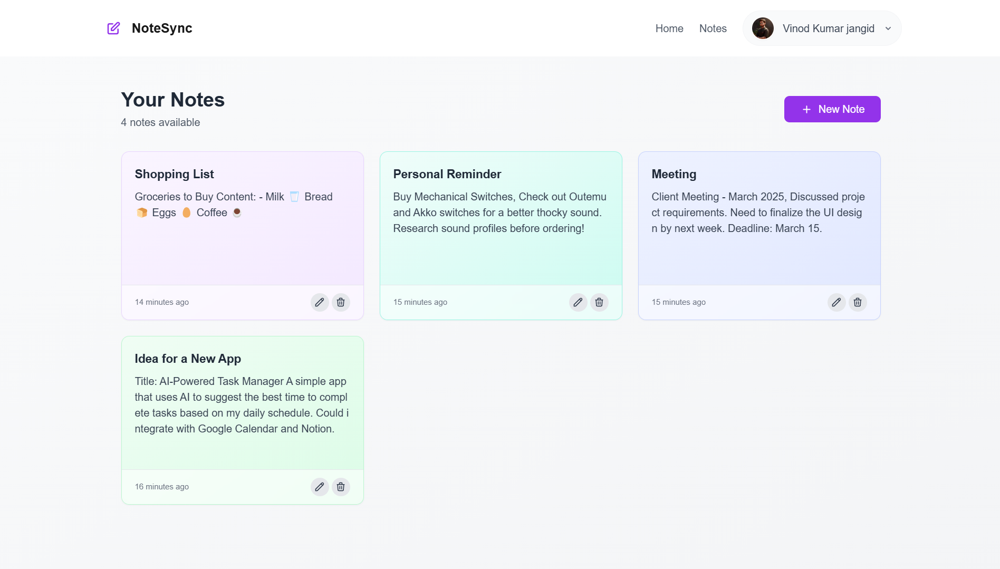

# NoteSync

A modern note-taking application built with Next.js and Supabase.



## Features

- **Secure Authentication**: Email/password authentication powered by Supabase Auth
- **Cloud Synchronization**: All notes are automatically saved to the cloud
- **Responsive Design**: Beautiful UI that works across desktop, tablet, and mobile devices
- **Real-time Updates**: Changes sync instantly across devices
- **Organized Interface**: Clean and intuitive UI for better productivity

## Tech Stack

- **Frontend**: Next.js 15 with App Router, React, TypeScript
- **Styling**: Tailwind CSS, Framer Motion for animations
- **Backend**: Supabase for authentication, database, and storage

## Getting Started

### Prerequisites

- Node.js (v18 or later)
- npm or yarn
- Supabase account

### Environment Setup

1. Clone the repository:
```bash
git clone https://github.com/vinodjangid07/notesync-supabase.git
cd notesync-supabase
```
2. Install dependencies:
```bash
npm install
# or
yarn install
```

3. Start the development server:
```bash
npm run dev
# or
yarn dev
```

4. Open http://localhost:3000 in your browser.

### Project Structure
/
├── app/                    # Next.js app router pages
│   ├── (auth)/             # Authentication routes
│   │   ├── sign-in/
│   │   └── sign-up/
│   ├── notes/              # Notes management
│   └── page.tsx            # Landing page
├── components/             # Reusable React components
│   ├── layout/             # Layout components like navbar, footer
│   └── notes/              # Notes-related components
├── public/                 # Static assets
│   └── images/
└── utils/                  # Utility functions

### License
- This project is licensed under the MIT License - see the LICENSE file for details.

### Acknowledgements
- UI components inspired by modern design practices
- Built with Supabase for backend functionality
- Designed and developed by vinodjangid07